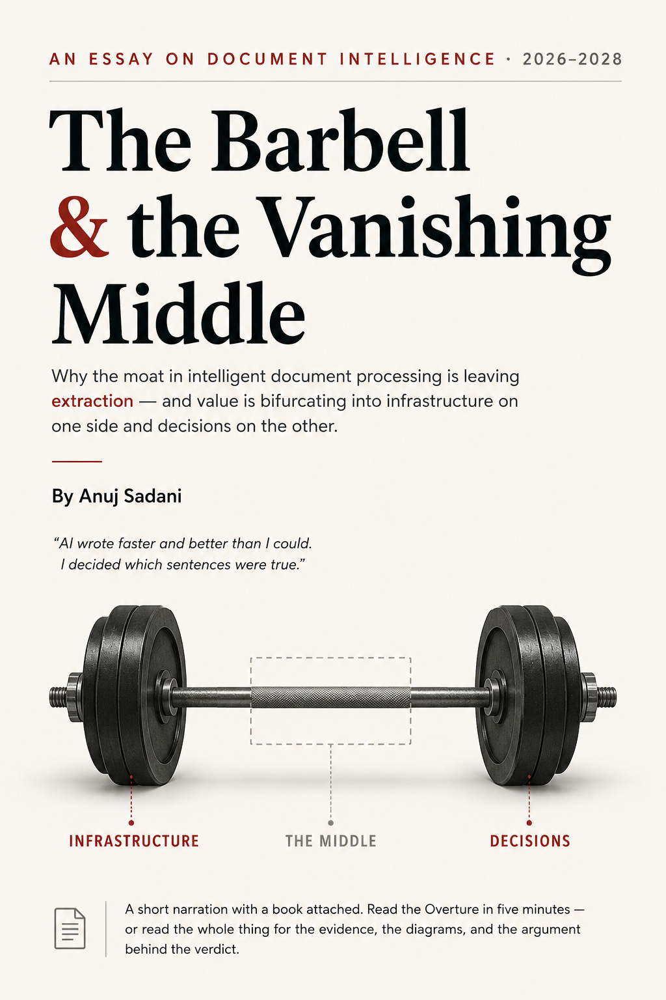

# The Barbell and the Vanishing Middle

<p align="center">
  
</p>

<p align="center">
  <strong><a href="https://tech.anujsadani.in/idp-barbell/">Read online</a></strong>
  &nbsp;&middot;&nbsp;
  <strong><a href="idp-barbell.pdf">Download the PDF</a></strong>
  &nbsp;&middot;&nbsp;
  <a href="https://ko-fi.com/s/3be014f2e6">Typeset edition on Ko-fi</a>
</p>

---

Where intelligent document processing is heading through 2028 — value migrating to infrastructure and decision automation while the extraction middle becomes invisible, not simple.

## What's here

| File | What it is |
|---|---|
| [`idp-barbell.pdf`](idp-barbell.pdf) | The typeset edition, 27pp. |
| [`idp-barbell.html`](https://tech.anujsadani.in/idp-barbell/) | The full text as one self-contained page. Read it online rather than as source. |
| `book.html.in` | The manuscript. Built by [book-forge](https://github.com/asadani/book-forge). |
| `meta.yaml` | Build configuration: cover, licence, front and back matter. |

## How it is built

The front matter and the closing author page are generated by
[book-forge](https://github.com/asadani/book-forge) from one shared source, so
they are identical across every book on the shelf:

```
bf inject     render the matter into book.html.in
bf build      html -> headless Chrome -> folio-stamped, self-audited PDF
```

## Licence

Copyright &copy; 2026 Anuj Sadani. All rights reserved.

Quote it in a review, in criticism, or in scholarship with attribution — that
needs no permission from anyone. For anything further, including translation,
reprinting or commercial use, please ask.

Written by **Anuj Sadani** — [anujsadani.in](https://anujsadani.in/) ·
[tech.anujsadani.in](https://tech.anujsadani.in/) ·
[ORCID 0009-0001-0124-3181](https://orcid.org/0009-0001-0124-3181)
